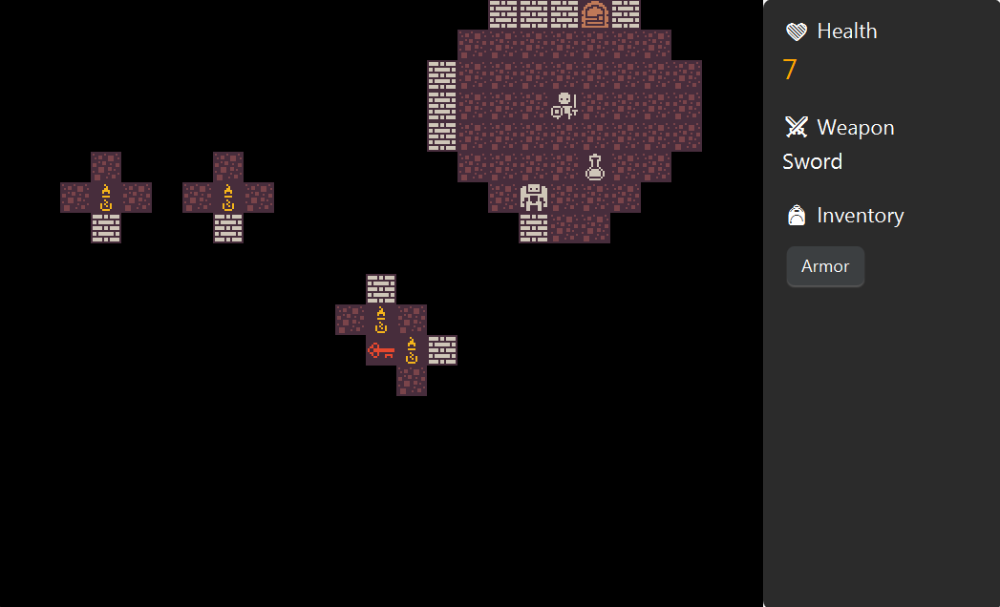
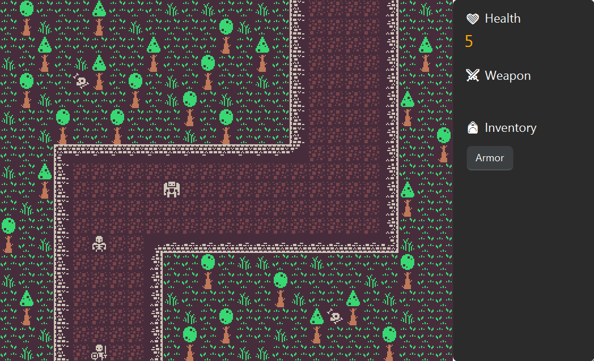

<a id="readme-top"></a>


<!-- PROJECT LOGO -->
<br />
<div align="center">
<h3 align="center">Dungeon Crawl</h3>

  <p align="center">
    Welcome to Dungeon Crawl! This is a simple 2D roguelike adventure made completely in Java. Your one goal: escape a dark dungeon that's crawling with monsters. You'll need to grab any weapons and equipment you can find to help you on your journey. Fight your way through and see if you can make it out!
    <br />
    <a href="https://github.com/Davidjuhasz05/dungeon-crawl"><strong>Explore the docs »</strong></a>
    <br />
    <br />
    <a href="https://github.com/Davidjuhasz05/dungeon-crawl/issues/new?labels=bug&template=bug-report---.md">Report Bug</a>
    &middot;
    <a href="https://github.com/Davidjuhasz05/dungeon-crawl/issues/new?labels=enhancement&template=feature-request---.md">Request Feature</a>
  </p>
</div>


<!-- TABLE OF CONTENTS -->
<details>
  <summary>Table of Contents</summary>
  <ol>
    <li>
      <a href="#about-the-project">About The Project</a>
      <ul>
        <li><a href="#screenshots">Screenshots</a></li>
        <li><a href="#built-with">Built With</a></li>
      </ul>
    </li>
    <li>
      <a href="#getting-started">Getting Started</a>
      <ul>
        <li><a href="#prerequisites">Prerequisites</a></li>
        <li><a href="#how-to-play">How to Play</a></li>
        <li><a href="#controls">Controls</a></li>
      </ul>
    </li>
  </ol>
</details>


<!-- ABOUT THE PROJECT -->
## About The Project

The game was built using the JavaFX framework. It currently features 3 Maps, 3 Enemies, 1 Weapon, 4 Items, and a fully functional Save/Load system with a PostgreSQL database.

### Screenshots

<p align="center">
  
  &nbsp; 
</p>

### Built With

[![Java]][Java-url]
[![JavaFX]][JavaFX-url]
[![Maven]][Maven-url]
[![PostgreSQL]][PostgreSQL-url]


<p align="right">(<a href="#readme-top">back to top</a>)</p>


<!-- GETTING STARTED -->
## Getting Started

### Prerequisites

  * An IDE installed ([IntelliJ IDEA](https://www.jetbrains.com/idea) recommended)
  * [PostgreSQL][PostgreSQL-url] installed

### How to Play

#### 1. Clone the Repository
```bash
git clone https://github.com/Davidjuhasz05/dungeon-crawl.git
cd dungeon-crawl
```

#### 2. Configure PostgreSQL

  * Create a new database and give it any name you want
  * Connect to that database and run the `createSqlTables.sql` script in `src > main > resources` to create the necessary tables for the database

#### 3. Configure Environment Variables

  * In your IDE, set the following environment variables for the App:
  ```
  dbName: <name-of-your-database>
  dbPassword: <your-psql-password>
  dbUsername: <your-psql-username>
  ```

#### 4. Start the Game and Have Fun!

### Controls

  * Movement: Arrow keys
  * Save Game: `S`
  * Load Game: `L`


<p align="right">(<a href="#readme-top">back to top</a>)</p>


<!-- MARKDOWN LINKS & IMAGES -->
<!-- https://www.markdownguide.org/basic-syntax/#reference-style-links -->
[contributors-shield]: https://img.shields.io/github/contributors/Davidjuhasz05/dungeon-crawl.svg?style=for-the-badge
[contributors-url]: https://github.com/Davidjuhasz05/dungeon-crawl/graphs/contributors
[forks-shield]: https://img.shields.io/github/forks/Davidjuhasz05/dungeon-crawl.svg?style=for-the-badge
[forks-url]: https://github.com/Davidjuhasz05/dungeon-crawl/network/members
[stars-shield]: https://img.shields.io/github/stars/Davidjuhasz05/dungeon-crawl.svg?style=for-the-badge
[stars-url]: https://github.com/Davidjuhasz05/dungeon-crawl/stargazers
[issues-shield]: https://img.shields.io/github/issues/Davidjuhasz05/dungeon-crawl.svg?style=for-the-badge
[issues-url]: https://github.com/Davidjuhasz05/dungeon-crawl/issues
[license-shield]: https://img.shields.io/github/license/Davidjuhasz05/dungeon-crawl.svg?style=for-the-badge
[license-url]: https://github.com/Davidjuhasz05/dungeon-crawl/blob/master/LICENSE.txt
[linkedin-shield]: https://img.shields.io/badge/-LinkedIn-black.svg?style=for-the-badge&logo=linkedin&colorB=555
[linkedin-url]: https://linkedin.com/in/david-juhasz-dave

[JavaScript]: https://img.shields.io/badge/JavaScript-F7DF1E?style=for-the-badge&logo=JavaScript&logoColor=000
[JavaScript-url]: https://developer.mozilla.org/en-US/docs/Web/JavaScript
[React.js]: https://img.shields.io/badge/React-20232A?style=for-the-badge&logo=react&logoColor=61DAFB
[React-url]: https://react.dev
[Vite.js]: https://img.shields.io/badge/Vite-646CFF?style=for-the-badge&logo=vite&logoColor=white
[Vite-url]: https://vite.dev
[React-Router.js]: https://img.shields.io/badge/React_Router-CA4245?style=for-the-badge&logo=react-router&logoColor=white
[React-Router-url]: https://reactrouter.com
[Spring-Boot]: https://img.shields.io/badge/Spring_Boot-6DB33F?style=for-the-badge&logo=spring&logoColor=white
[Spring-Boot-url]: https://spring.io/projects/spring-boot
[Java]: https://img.shields.io/badge/Java-ED8B00?style=for-the-badge&logo=openjdk&logoColor=white
[Java-url]: https://www.oracle.com/java
[JavaFX]: https://img.shields.io/badge/JavaFX-4EA9C4?style=for-the-badge&logo=openjdk&logoColor=white
[JavaFX-url]: https://openjfx.io
[Maven]: https://img.shields.io/badge/Maven-C71A36?style=for-the-badge&logo=apachemaven&logoColor=white
[Maven-url]: https://maven.apache.org
[PostgreSQL]: https://img.shields.io/badge/PostgreSQL-316192?style=for-the-badge&logo=postgresql&logoColor=white
[PostgreSQL-url]: https://www.postgresql.org
[Docker]: https://img.shields.io/badge/Docker-2496ED?style=for-the-badge&logo=docker&logoColor=white
[Docker-url]: https://www.docker.com
[Kubernetes]: https://img.shields.io/badge/Kubernetes-326CE5?style=for-the-badge&logo=kubernetes&logoColor=white
[Kubernetes-url]: https://kubernetes.io
[kubectl-url]: https://kubernetes.io/docs/tasks/tools
[Terraform]: https://img.shields.io/badge/Terraform-7B42BC?style=for-the-badge&logo=terraform&logoColor=white
[Terraform-url]: https://developer.hashicorp.com/terraform
[Terraform-download-url]: https://developer.hashicorp.com/terraform/downloads
[Helm]: https://img.shields.io/badge/Helm-0F1326?style=for-the-badge&logo=helm&logoColor=white
[Helm-url]: https://helm.sh
[Helm-install-url]: https://helm.sh/docs/intro/install
[AWS-CLI-url]: https://aws.amazon.com/cli